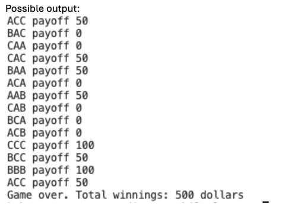

Creating a PHP Slot Game
Objective: Develop a simple slot game using PHP that incorporates arrays, the match()
expression, loops, and logical conditions.
Create a slot_game.php (there is no html in this lab)
1. Initialize Game Variables:
- Create an array with the symbols `A`, `B`, and `C`.
2. **Run the Game Loop**:
- Use a while loop to perform spins until the total winnings reach 500 dollars or
you have completed 20 spins.
**Generate Each Spin**:
- Inside the loop, using a for loop generate a spin by randomly selecting three
symbols from the array above. see page 218 for array_rand()
- Concatenate these symbols to form a string that represents the spin (i.e. ‘ABB’).
**Determine PayoG**:
- Use a match expression to determine the payout based on the spin result.
Possible Combinations for Payouts:
Three Identical Symbols: Payout 100 credits
• AAA, BBB, CCC
Two Identical Symbols and One DiGerent: Payout 50 credits
• AAB, ABA, BAA
• ABB, BBA, BAB
• BCC, CBC, CCB
• ACC, CAC, CCA
Any Other Combination: Payout 0 credits
**Update Results and Track Spins**:
- Add the determined payout to the total winnings.
- Create a string from the spin holds the spin and its corresponding payoK in
the array.
Example: “ACC Payoff 50”
3. **Output Results**:
- After exiting the loop, use a foreach to display each element in the array that is
holding each spin.
- Display the total winnings at the end of the game.
